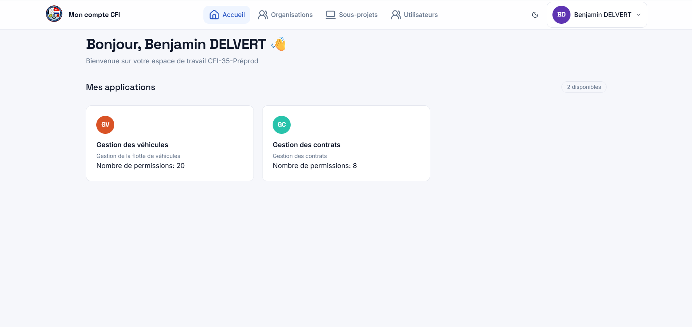

# Plateforme de gestion du CFI-35

> Plateforme web centralisant la gestion de la flotte de véhicules, des carnets de bord et des contrats du Centre de Formation et d’Intervention de la SNSM d’Ille-et-Vilaine.

---

## 📌 Présentation

Ce projet consiste en la conception et le développement d’une **plateforme web de gestion interne** destinée au Centre de Formation et d’Intervention de la SNSM d’Ille-et-Vilaine.

L’objectif principal est de **centraliser plusieurs outils de gestion** auparavant dispersés, afin de faciliter le suivi des activités du centre et de permettre aux utilisateurs de retrouver les informations dont ils ont besoin depuis une même plateforme.

La plateforme est organisée autour d’un portail principal donnant accès aux différents modules selon les **droits et permissions de chaque utilisateur**.

### Objectifs

- Centraliser les informations importantes du centre.
- Améliorer le suivi de la flotte de véhicules.
- Dématérialiser les carnets de bord.
- Anticiper les échéances importantes.
- Faciliter le renouvellement des contrats.
- Donner à chaque utilisateur un accès adapté à ses responsabilités.

---

## 🖼️ Aperçu de la plateforme

**Capture d’écran – Portail principal**


Cette interface constitue le point d’entrée de la plateforme et permet à l’utilisateur d’accéder aux différents modules auxquels il est autorisé.

---

# 🧩 Architecture fonctionnelle

La plateforme est organisée autour de plusieurs modules métier :

```text
                         ┌──────────────────────┐
                         │   Portail principal  │
                         │ Compte & permissions │
                         └──────────┬───────────┘
                                    │
                    ┌───────────────┴───────────────┐
                    │                               │
                    ▼                               ▼
             ┌─────────────┐                 ┌─────────────┐
             │  Véhicules  │                 │  Contrats   │
             └──────┬──────┘                 └─────────────┘
                    │
                    ▼
             ┌─────────────┐
             │ Carnets de  │
             │    bord     │
             └─────────────┘
